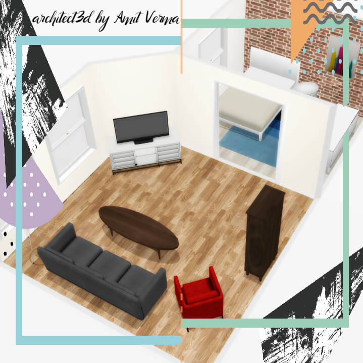

WebGL based 3D interior designing tool with 2D Floor Planer
## About
This is a customizable application built on three.js that allows users to design an interior space such as a home or apartment.

[Live Demo](http://amitukind.com/projects/architect3d/)



 Below are screenshots from  [Live Demo](http://amitukind.com/projects/architect3d/)

1) Create 2D floorplan:


2) Add items:


3) Design in 3D:


## Developing and Running Locally

To get started, clone the repository and ensure you npm >= 3 and rollup installed, then run:

    npm install
    rollup -c

Rollup will only run if you have enabled command execution . If not run the following command first :
```bash
//Windows 10
Get-ExecutionPolicy -List
Set-ExecutionPolicy -ExecutionPolicy RemoteSigned -Scope CurrentUser
```
The latter command generates `build/js/bp3djs.js` from `src`. 

```
NODE_ENV=production rollup -c
```

The above command will generate `build/js/bp3djs.min.js` a minified and uglified version of the js. The easiest way to run locally is by

```
     rollup -c -w
```
Then, visit `http://localhost:10001` in your browser.


## Directory Structure

### `src/` Directory

The `src` directory contains the core of the project. Here is a description of the various sub-directories:

`core` - Basic utilities such as logging and generic functions

`floorplanner` - 2D view/controller for editing the floorplan

`items` - Various types of items that can go in rooms

`model` - Data model representing both the 2D floorplan and all of the items in it

`three` - 3D view/controller for viewing and modifying item placement


## DOCS ##
Included


## Author
[@amitukind](https://github.com/amitukind/) | [Website](http://amitukind.com/) | [amitverma.ukind@gmail.com](mailto:amitverma.ukind@gmail.com)

## project Deatil

This 3D Architect project is designed to offer users a versatile experience by providing 2D, 3D, and VR modes for home decor using the Three.js library. The functionality allows users to personalize their living spaces by adding furniture, decor elements, and adjusting the colors of walls and floors. In 2D mode, users can plan and arrange items, while the 3D mode provides a more immersive preview. The VR mode allows users to experience their home in virtual reality, offering a realistic and interactive visualization of their design choices.